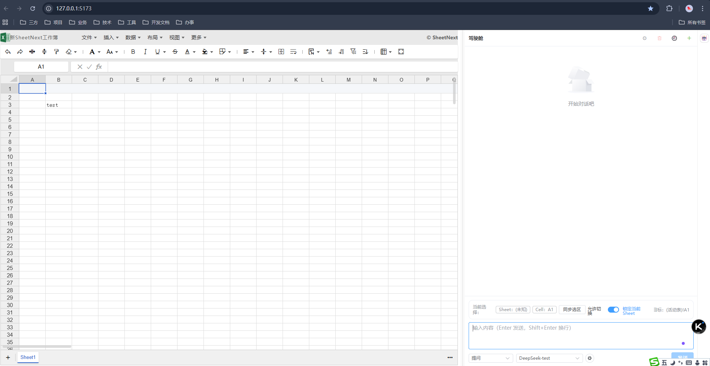
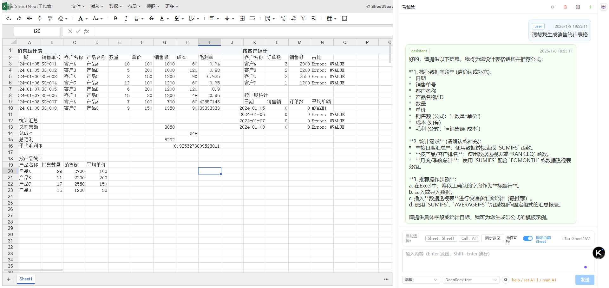
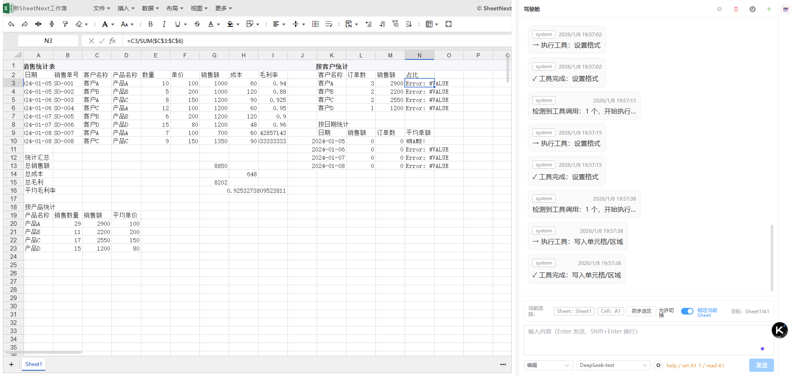
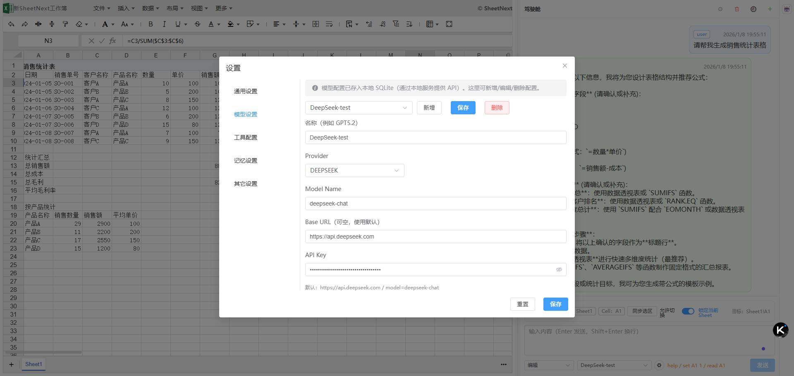

# SheetNext Excel AI（表格 AI 驾驶舱）

在 **SheetNext** 表格组件旁边提供一个可折叠的 **AI 驾驶舱**：你可以一边编辑表格，一边用对话的方式让模型理解当前工作簿上下文，并调用内置工具完成表格相关操作。

> 这是一个前端（Vue + Vite）+ 本地 API（Express）的小型应用。模型配置、系统提示词、会话历史等信息会存入本地 SQLite（`data/sheetnext.db`）。

---

## 功能亮点

- **表格工作区（SheetNext）**
  - 左侧是完整的表格编辑区（SheetNext）。

- **AI 驾驶舱（右侧面板，可拖拽宽度/折叠）**
  - 与表格并排显示，支持拖拽调整宽度、折叠/展开。
  - 以对话方式输入需求，AI 会结合当前工作簿上下文进行回答与操作。

- **会话管理**
  - 新建会话、清空消息。
  - 查看/加载历史会话（本地保存）。

- **可配置的模型与提示词**
  - 在“设置”中维护 **模型配置**（provider/baseUrl/model/apiKey）。
  - 在“设置”中维护 **系统提示词（system prompt）**，用于约束模型风格与能力边界。

- **工具配置（Tooling）**
  - 可选择本次对话允许使用的工具集合（全启用/自定义）。
  - 便于在“安全/可控”前提下让模型做表格相关动作。

---

## 界面截图

> 截图位于 `docs/` 目录。

### 1）主界面：SheetNext 表格 + AI 驾驶舱



说明：左侧为表格工作区，右侧为可折叠的 AI 驾驶舱面板。

### 2）对话与上下文



说明：在驾驶舱中以聊天形式提出需求，消息会记录并可回溯。

### 3）设置：系统提示词 / 模型配置



说明：可维护系统提示词与模型连接信息（如 API Key、Base URL、模型名等）。

### 4）更多配置：工具选择 / 会话管理



说明：支持工具集合选择、历史会话查看与加载等。

---

## 本地运行

### 方式 A：同时启动前端 + 本地 API（推荐）

```bash
npm install
npm run dev:full
```

- 前端开发服务器：默认 `http://127.0.0.1:5173`
- 本地 API（存储/配置/会话）：默认 `http://127.0.0.1:5175/api`

### 方式 B：分别启动

前端：

```bash
npm run dev
```

本地 API：

```bash
npm run dev:server
```

---

## 构建与预览

```bash
npm run build
npm run preview
```

---

## 数据与隐私

- 本项目会将以下信息写入本地 SQLite：
  - 模型配置（可能包含 **API Key**）
  - 系统提示词
  - 会话与消息历史
- 数据库文件默认在：`data/sheetnext.db`

如果你要把仓库公开，建议确保数据库文件不包含敏感信息，并考虑将 `data/*.db` 加入 `.gitignore`。

---

## 项目结构（简要）

- `src/`：前端源码（Vue）
  - `App.vue`：表格区 + 驾驶舱布局、历史会话弹窗
  - `components/AiCopilot.vue`：AI 驾驶舱（对话、设置、工具选择等）
  - `services/`：与本地 API/模型请求相关的服务层
- `server/`：本地 API（Express）
- `data/`：本地 SQLite 数据库文件
- `docs/`：README 用截图

---

## 常见问题

### 端口被占用怎么办？

项目默认使用：
- Vite：`5173`
- API：`5175`（可通过环境变量 `LLM_DB_PORT` 修改）

可以参考脚本：

```bash
npm run dev:clean
```

### API Key 存在哪里？

模型配置会写入 `data/sheetnext.db`。这对于本地开发很方便，但请避免将带密钥的数据库提交到公共仓库。
